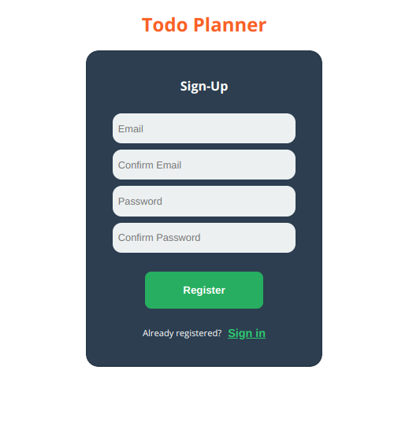
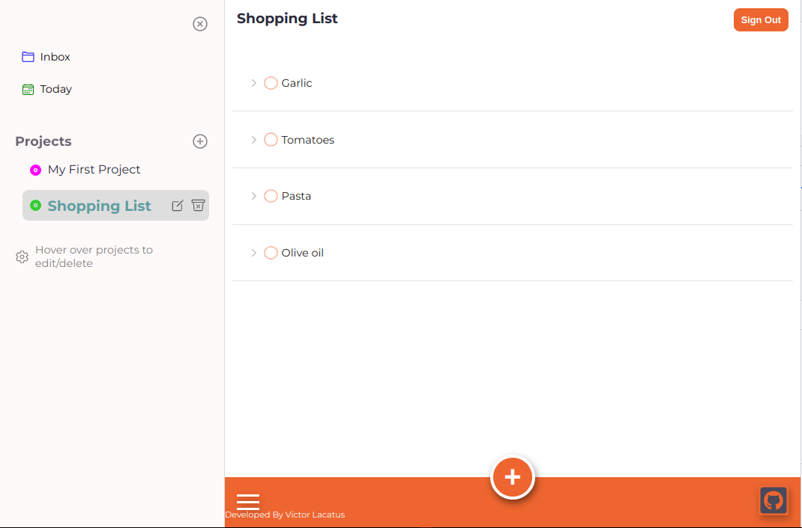

# React-Todo-App

React-Todo-App is a mobile-ready todo app bootstrapped with create-react-app that uses authentication and database services from Firebase.
A basic version of the feature heavytodois and very popular Todoist app (https://todoist.com/), which i used as inspiration for the design.

## Demo

You can access a live version of the website by following this link:
https://georgevictor90.github.io/react-todo-app/

## Features

- Login or register a new account to use the app
- Create and edit projects
- Create new tasks or mark existing ones as complete
- Each session remembers the last project you visited
- "Today" section displays all the tasks for the current day
- "Inbox" section displays all tasks that are not part of a project
- Responsive and easy-to-use interface

## Screenshots

## Tech

React-Todo-App uses a number of different technologies to work properly:

- [ReactJS](https://reactjs.org/ "ReactJS") - JavaScript library for building user interfaces
- [Firebase Authentication](https://firebase.google.com/docs/auth "Firebase Authentication") - to authenticate users using email and password
- [Firebase Cloud Firestore](https://firebase.google.com/docs/firestore "Firebase Firestore") - use as backend to store projects and tasks for each user
- Local Storage - to keep track of last visited project

## License

[MIT](https://choosealicense.com/licenses/mit/)
